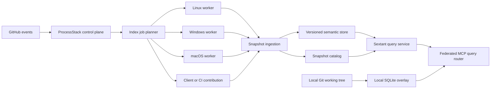

# Architecture

## Decision summary

Sextant will use a hybrid local/remote architecture:

- SQLite remains the local storage engine and working-tree overlay.
- Committed semantic data is published as immutable, versioned snapshots.
- A standalone Sextant service owns snapshot ingestion, storage, query planning, and low-latency MCP.
- ProcessStack owns repository-event coordination, durable workflow state, worker dispatch, credentials, progress, retries, and audit events.
- Indexing is routed to an execution environment capable of faithfully evaluating the requested project and target framework.
- Developer and CI machines may contribute committed per-project index artifacts, but local uncommitted overlays are not uploaded by default.

The first implementation remains useful without ProcessStack. The distributed layers build on a correct and scalable local indexer rather than creating a second extractor.

## Current-state evidence

The current pipeline has four architectural bottlenecks:

1. `SymbolFinder.FindReferencesAsync` is invoked for each declared symbol over the complete solution.
2. member display strings are used as identities even when they are not unique, causing symbol overwrites and repeated reference searches;
3. stores execute one command per row without a surrounding indexing transaction; and
4. absolute paths and context snippets are repeated in high-cardinality tables and indexes.

The current mutable project row also combines two different concepts:

- a **logical project**, which is stable across clones and commits; and
- an **indexed project version**, whose source, dependencies, target framework, and semantic output belong to one evaluated revision.

That distinction is required before branch, submodule, or cross-repository support can be correct.

## Target components

### Local indexer

The local indexer owns Roslyn/MSBuild evaluation, semantic extraction, compact SQLite persistence, Git diff discovery, and working-tree file watching. It can operate entirely without a server.

### Index worker

An index worker evaluates one immutable repository commit in a declared environment and emits one or more project-version contributions. A worker may run inside a ProcessStack-selected sandbox, as a dedicated persistent Sextant worker, or on an authenticated client/CI machine.

### Snapshot ingestion

Ingestion validates artifact version, repository, commit, configuration, project graph, content hashes, completeness, and provenance before atomically publishing a snapshot. It is idempotent on:

`tenant + repository + commit + schema version + analyzer version + configuration hash`

### Query service

The query service exposes the current Sextant MCP surface plus explicit snapshot, scope, completeness, and provenance metadata. It resolves default branch pointers to immutable snapshots and enforces authorization before query planning.

### ProcessStack adapter

The adapter maps GitHub events to idempotent snapshot requests, waits asynchronously for worker/service status, records durable orchestration state, and publishes completion/failure events. Low-latency semantic queries remain in the Sextant data plane.

## Identity and version model

### Repository

`repository_id` is tenant-scoped and derived from the normalized provider installation and repository identity, not only a URL string. Repository renames and remote aliases retain a stable internal ID.

### Commit snapshot

A snapshot is immutable and identified by repository commit plus index-production inputs:

- commit SHA and tree SHA;
- schema and analyzer versions;
- configuration/profile hash;
- toolchain capability fingerprint; and
- status: pending, complete, partial, failed, unsupported, or superseded.

Branch names are mutable pointers to snapshots. Branch names never appear in semantic-row primary keys.

### Logical project

A logical project is:

`repository + repository-relative project path + target framework`

Runtime identifier and configuration become additional dimensions only when they change the evaluated compilation.

### Project version

A project version is the immutable evaluated result for a logical project. Its fingerprint covers:

- project and imported MSBuild inputs;
- source and additional-file Git blobs;
- analyzer configuration;
- package lock/assets inputs;
- referenced project-version fingerprints;
- SDK feature band and workload-set version; and
- Sextant analyzer/configuration version.

The first implementation may conservatively key project versions by repository commit. Content-addressed reuse across commits can be added after correctness is proven.

### Symbol

Symbols have two identities:

- `logical_symbol_key`: project definition plus Roslyn documentation ID or an equivalent stable semantic key;
- `symbol_definition_id`: logical symbol plus project version.

FQN is query/display data, not the primary key. Source-only constructs without a stable documentation ID use a versioned source declaration key based on file identity, declaration span, and semantic kind. Anonymous implementation artifacts are excluded unless a query feature explicitly requires them.

### Occurrence

An occurrence records a source location in a project version:

- source/enclosing symbol definition;
- target logical or versioned symbol key;
- normalized file version and span;
- occurrence kind and access kind; and
- optional typed detail for calls or dataflow.

The uniqueness key prevents the same semantic location from being inserted twice.

## Extraction pipeline

1. Load the solution/project graph and record all workspace diagnostics.
2. Evaluate each target framework as a distinct logical project.
3. Build a declaration catalog from compilation symbols and supported source declarations.
4. For each source document, obtain one syntax root, semantic model, and operation root.
5. Walk the document once to emit references, calls, inheritance, implementation, overrides, attributes, comments, and optional dataflow.
6. Deduplicate in-memory contributions by stable identity and occurrence key.
7. Send deterministic batches through a bounded channel to one SQLite writer.
8. Commit at project/document-batch boundaries and checkpoint WAL within configured limits.
9. Atomically mark the index run or snapshot complete only after validation.

The initial implementation prioritizes determinism and bounded resource use. Parallelism is configurable and capped; it does not scale directly with document count.

## Compact local storage

The normalized schema introduces:

- repositories and logical projects;
- index runs/snapshots;
- files and file versions using repository-relative paths and Git/content hashes;
- logical symbols and versioned definitions;
- occurrences with compact integer kinds and source spans;
- relationship and dataflow detail keyed to occurrences;
- project-version dependencies; and
- explicit completeness/provenance records.

Context snippets are derived at query time from a local file or one stored/fetched source blob. Repeating a 120-character snippet and absolute path for every reference is prohibited.

The migration is forward-only and builds a new schema generation beside the old index. The old database remains readable until the new index validates and is atomically selected.

## Local overlay and query merge

A local overlay is based on an exact committed snapshot:

1. At startup, discover changed, renamed, deleted, and untracked files relative to `HEAD`.
2. Reconcile this authoritative Git diff before enabling file watching.
3. Store replacement definitions and occurrences for changed files.
4. Store tombstones for deleted files and base rows shadowed by changed files.
5. Escalate project/import/SDK configuration changes to project-level invalidation.
6. Keep uncommitted source and semantic rows local unless explicitly uploaded.

Federated queries:

- exclude base rows from touched or deleted files;
- prefer overlay definitions for changed logical symbols;
- union unaffected base occurrences with overlay occurrences;
- expose base commit, overlay freshness, completeness, and stale-dependent warnings; and
- fall back to a full local index when server and local schema/analyzer versions are incompatible.

## Submodules and cross-repository usages

A parent snapshot stores a dependency on the exact repository and commit pinned by the submodule entry. It references the existing provider project version instead of importing its symbols again.

Consumer occurrences target stable logical symbol keys. The reverse-usage catalog can therefore answer:

- which authorized repositories consume a project or symbol;
- which default-branch heads contain usages;
- which commit or submodule pin each consumer resolved against; and
- whether the usage targets the same symbol lineage as the currently selected producer definition.

Default query scope is the current repository plus authorized default-branch heads in its dependency/consumer closure. Historical branches and commits require an explicit scope to prevent duplicate or surprising results.

## ProcessStack integration

ProcessStack is the control plane because it already supplies:

- tenant-bound GitHub installation and webhook validation;
- durable Orleans orchestration and reminders;
- at-least-once JetStream platform events;
- capability-aware isolated worker selection;
- persistent run/event/audit data;
- large-payload and job-artifact seams; and
- authenticated application/process MCP.

Required additions:

- normalize GitHub `push`, branch create/delete, and relevant pull-request head/base events into repository-change events;
- define an idempotent `EnsureSextantSnapshot` orchestration;
- register Sextant worker capability requirements;
- persist snapshot references and progress, not semantic rows;
- upload or retain snapshot artifacts outside ephemeral worker directories; and
- expose bounded control operations through ProcessStack while routing semantic queries to Sextant.

At-least-once delivery means the snapshot request key and publish operation must be idempotent. A duplicate event may attach to existing work but may not create a second snapshot.

## Security and tenancy

- Every repository, snapshot, dependency, symbol result, and reverse-usage result is tenant- and principal-authorized.
- Cross-repository results never reveal the existence or metadata of an inaccessible repository.
- MSBuild evaluation is treated as execution of untrusted repository code.
- Remote indexing runs in restricted workers with no ambient production secrets, bounded CPU/memory/disk/time, controlled package feeds, and network policy.
- Native Windows/macOS worker placement is explicit and fails closed.
- Contribution uploads are authenticated, integrity checked, size limited, malware scanned where applicable, and validated against provider commit content.
- Uncommitted content upload is disabled by default and separately consented.

## Observability and service objectives

Every index run records:

- load/evaluation/extraction/persistence/publish durations;
- projects, files, syntax nodes, definitions, occurrences, and duplicates;
- main DB, WAL, artifact, and source-blob bytes;
- peak managed memory and worker resource limits;
- cache/project-version reuse;
- workspace diagnostics and unsupported capability reasons;
- contribution provenance; and
- query freshness/completeness.

Initial objectives:

- no silent partial snapshots;
- one-file local changes queryable within five seconds at p95;
- exact committed snapshot queries within the existing MCP latency budget once cached;
- index jobs resumable or safely retryable after worker loss; and
- deterministic output for identical inputs and analyzer versions.

## Compatibility and rollout

1. Ship correctness and metrics behind the existing local interface.
2. Add the new extractor behind a comparison flag and run old/new differential tests.
3. Build the compact schema as a new profile generation.
4. Enable local overlays with an automatic full-local fallback.
5. Pilot immutable snapshots and direct Sextant service operation.
6. Add ProcessStack coordination and one Linux worker pool.
7. Add Windows/macOS routing and client/CI contributions.
8. Enable cross-repository queries for an explicit pilot repository set.
9. Expand retention and default scopes only after authorization and cost telemetry are validated.
