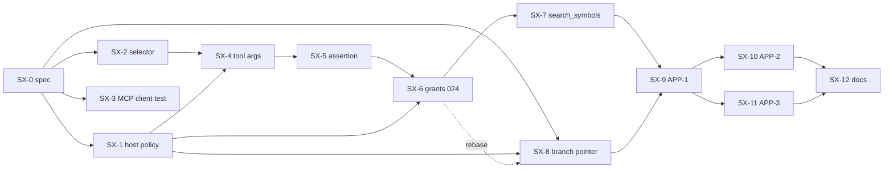

# PR plan (Sextant side)

> **Approved at G1 (2026-09-27). Tracking: elevenworks/ProcessStack#3159.** The SX numbering matches the initiative plan. The gates G1/G2a/G2b/G2c/G3 are defined in [`cutover-runbook.md`](cutover-runbook.md), and PS-11 in [`processstack-deletion.md`](processstack-deletion.md).
> Every SX PR:
> - goes through the repo's `/implement-clean` loop (build + `dotnet test Sextant.slnx`, then a careful self-review; this repo has no review bot, so CI (Build & Test + SonarCloud) must be green);
> - keeps the core libraries ProcessStack-agnostic (`ArchitectureBoundaryTests`);
> - leaves the local stdio path byte-identical.

## Units

| SX | Maps to | Title | Size | Depends on | Gate |
|---|---|---|---|---|---|
| SX-0 | spec | Restore `specs/` with `specs/20260927-processstack-app-extraction/` (these 5 files + the runbook + the deletion plan) | XS, docs only | G1 approval | G1 |
| SX-1 | SVC-5 | `RepositoryUrlPolicy` + `REPOSITORY_HOSTS`/`REPOSITORY_OWNERS` at ensure intake | S | — | G2b |
| SX-2 | SVC-1 | Selector always wired; `RequireRepositorySelection` hook + env | S | — | G2b |
| SX-3 | SVC-8 | MCP SDK client-over-HTTP compatibility test; stateless comment/test reframing | XS | — | G2b |
| SX-4 | SVC-2 | Reserved `repository`/`branch` tool args (list/call filters); `RequestedBranch`; branch-pinned selection | M | SX-2, SX-1 (canonicalizer) | G2b |
| SX-5 | SVC-3 | Caller-assertion verifier (incl. `idp`/`sub` namespace checks), `DELEGATE_TOKENS`, `CALLER_KEYS`, `CALLER_AUDIENCE`/`ISSUERS`/`HEADER`/`IDPS`/`APPS`; delegate reads deny-all until SX-6 | M | SX-4; the PS-7 (F4) contract | G2b |
| SX-6 | SVC-4 | Migration **024** `repository_grants`; `/control/grants*`; `GrantReadAuthorizer` + per-request composite; ensure/status `act=user` gates; `list_repositories` | L | SX-5, SX-1 | G2b |
| SX-7 | SVC-F | Federated `search_symbols` (composite cursor, pending/unavailable) | M | SX-6 | G2b |
| SX-8 | SVC-6+7 | `expected_head_commit` CAS, `branch_update: none`, `forced`, `POST /control/branches/retire`, resolve `commit_sha`/`branch`/`is_default`/`head_sequence`, `branch_advanced` | M | SX-1 (policy on retire); rebase after SX-6 | G2b |
| SX-9 | APP-1 | App skeleton: `psapp.yaml` (connections, `mcp.connectionTools`, processes `start-indexing`/`get-indexing-status`), README, `.github/workflows/processstack-app.yml`, their scenarios | M | **PS-8 (F3)** (manifest schema in the CLI), **PS-6 scenario stubs**, the first `cli-v*` release to the private elevenworks GitHub Packages feed (approved; cut by the orchestrator after PS-6 merges); the app repo location decision; SX-8 contract (start-indexing CAS) | G2c |
| SX-10 | APP-2 | `on-repository-change` + `reconcile` (with the v2.0.x legacy enrollment import, run once at G2c by trigger run-now), the `ensure`/`tenant-grant` processes, the enrolled dual-write, their scenarios | M | SX-9; **PS-5 GitHub repository events**; **PS-7 (F4)** (`act=application` for connection-event/schedule/run-now); SX-6 and SX-8 contracts | G2c |
| SX-11 | APP-3 | `configure-watched-repos` chat (internal channels; Slack gated off in v2.0), `grant-watch`, `import-legacy-watches`, lazy import, memory dual-write + tombstones, their scenarios | M | SX-9; SX-6 contract; **PS-6 scenario stubs** (`seed.userMemory`, `principal`); **PS-7** (`idp`) | G2c |
| SX-12 | SVC-16 | Docs: `docs/service.md` (new env, grants, assertion, retire, selectors), onboarding rewrite (drop the `_sextant` Mode A), `CLAUDE.md` rules (grants, assertion, host policy; fix the Host→.Mcp dependency drift at `CLAUDE.md:36-37`) | S | SX-1…SX-11 | G2c |
| post-G3 | APP v2.1 | Drop the dual-write and reconcile's legacy enrollment import; clean up legacy keys through the app: App State `enrolled/*`, `sextant-service-url`, `sextant-control-token`, and per-user `sextant.watched-repos` memory via `DeleteMyMemory` | S | G3 (PS-11 deployed); **PS-13 `DeleteMyMemory`** | after G3 |
| post-G3 | ops | `REQUIRE_REPOSITORY_SELECTION=true`; retire the legacy `QUERY_TOKEN` by **replacing** it with a fresh value (or configuring a `READ_POLICY`), never by unsetting it: with no query token and no read policy the query plane is open to anonymous reads (`docs/service.md`, "After the cutover (G3), not before") | config | G3 | after G3 |

## As-built status (2026-09-28)

Every SX unit is merged on `main` except SX-12 (this docs unit). Two units were added during the work: SX-U (the MCP C# SDK upgrade to 2.2.0, the version ProcessStack's MCP connection uses) and SX-13 (the app's own activities, `app-activities.md`), and four hardening follow-ups came out of reviews (SX-5b, SX-6c, SX-6d, SX-7b).

| SX | PR | Merge | What landed |
|---|---|---|---|
| SX-0 | #183 | `935e4571` | This spec |
| SX-1 | #186 | `0462d33f` | SVC-5 URL/host policy at ensure intake |
| SX-2 | #184 | `e05b548c` | SVC-1 selector always wired; fail-closed selection hook |
| SX-3 | #185 | `620903b4` | SVC-8 MCP-client compatibility test |
| SX-U | #187 | `4d9753f1` | MCP C# SDK 2.2.0 |
| SX-4 | #188 | `dbd046e5` | SVC-2 reserved `repository`/`branch` tool args |
| SX-5 | #190 | `29650a6e` | SVC-3 caller assertions and delegate tokens |
| SX-5b | #192 | `03eceb6a` | The assertion's `dep` claim made optional |
| SX-6 | #191 | `17212f6d` | SVC-4 grants (migration 024), visibility, `list_repositories` |
| SX-6c | #197 | `bc1751cf` | `act=user` refused on retire and the operational control routes (#193) |
| SX-6d | #202 | `8aee3c03` | User ensure bodies bounded; no implicit default for a user; startup refused without a control token (#198, #199) |
| SX-7 | #195 | `8ae27f3a` | SVC-F grant-scoped federated `search_symbols` |
| SX-7b | #200 | `aec5d4ac` | Per-call cost bounds for `search_symbols`, migration 025 (identity-neutral) (#196) |
| SX-8 | #189 | `a6945d0b` | SVC-6+7 head CAS, `branch_update: none`, retire, resolve `commit_sha` |
| SX-9 | #204 | `4704d89c` | App skeleton, chat, MCP processes, scenarios, CI |
| SX-10 | #207 | `c2e79a4f` | Repository events, enrollment, nightly reconcile |
| SX-11 | #208 | `33896e64` | MCP connection tools, legacy watch import, README |
| SX-13 | #194 | `91abf693` | `Sextant.ProcessStack.Activities`, the app's activity bundle |
| SX-12 | this PR | — | Docs (this unit) |

Open follow-ups filed from the reviews include #209 (a user ensure with `branch_update: none` can index any reachable commit, fork-network commits included) and #210 (the legacy import's follow-ups, including the workspace-level visibility gate). The post-G3 rows above are not started.

> **Resolved: the app lives in this public repo (option A).** SX-9…SX-11 and SX-13 landed at `apps/processstack/sextant/`. CI restores the CLI with the `PROCESSSTACK_PACKAGES_TOKEN` PAT once a human adds it; until then the app job emits a notice and skips (it still skips on `main` as of this writing, so `app validate`/`app test` have run only locally). The option considered instead was a private ProcessStack-org repo whose `GITHUB_TOKEN` gets package access through "Manage Actions access".

## Stacking and parallelism

| Lane | PRs | Why |
|---|---|---|
| Stacked chain | SX-2 → SX-4 → SX-5 → SX-6 → SX-7 | Shared `ServiceApp.cs` regions: DI `:51-71`, the MCP builder `:93-102`, `RemoteQueryTools` `:115-125`, middleware `:138-165`, control maps `:216-362` |
| Parallel | SX-1, SX-3, SX-8 | SX-1 touches only the ensure route plus a new file. SX-3 is tests plus a comment. SX-8 is mostly `SnapshotService`/`SnapshotStore`/`IndexOrchestrator`/`ServiceContracts`, and rebases once after SX-6 for the control-map region |
| App lane | SX-9 → (SX-10 ∥ SX-11) | Can be **authored** against the spec'd contracts as soon as the PS CLI with PS-8 (F3) and the PS-6 scenario stubs is published. Merge after the service contracts land, so scenario stubs match real shapes |
| Last | SX-12 | Documents the final state |

**Merge rule for the chain:** SX-5 alone makes delegate reads deny-all. That is safe because nothing uses delegate tokens before G2c, but **SX-5 and SX-6 ship in the same G2b image**.

## PS feature dependency matrix

| PS # | Feature | Spec slug | Blocks | Needed at |
|---|---|---|---|---|
| PS-1 | Platform/app boundary | `20260927-platform-app-boundary` | — (guardrail) | G3 |
| PS-2 | Sender-id hardening (elevenworks/ProcessStack#3141; prerequisite of PS-7) | — | PS-7 | G2a |
| PS-3 | Unregistered-grant pruning | `20260927-unregistered-grant-pruning` | Removing `mcp:sextant:read` at G3 | G3 |
| PS-4 | Live-bounded API keys | `20260927-live-bounded-api-keys` | The G2c agent key | G2a |
| PS-5 | GitHub repository events | `20260927-github-repository-events` | SX-10 | G2a (deploy), SX-10 (CLI trigger validation) |
| PS-6 | Scenario connection stubs | `20260927-scenario-connection-stubs` | SX-9/10/11 tests | CLI release before SX-9 |
| PS-7 | F4 outbound caller identity (`RunCaller`, `idp`) | `20260927-outbound-caller-identity` | Every G2c flow. SX-5 is implemented to this contract | G2a |
| PS-8 | F3 MCP connection-tool exposure | `20260927-mcp-connection-tool-exposure` | SX-9 validate/test; the query path | G2a (deploy), SX-9 (CLI) |
| PS-13 | `DeleteMyMemory` / `DeleteUserMemory` activities (`IUserMemoryStore.DeleteAsync` already exists) | — | APP v2.1 cleanup. v2.0 uses `null` tombstones | Before v2.1 |
| — | Trigger run-now (**exists**: `POST /v1/{tenant}/triggers/run/{triggerId}`, PS:`TriggersController.cs:399-416`, `triggers:write`) | — | The G2c one-shot enrollment import (`nightly-reconcile`, runs as `act=application`) | G2c (no PS change) |
| — | Generic connection-binding restriction (a generic PS issue tracks it) | — | Nothing. Mitigated service-side by `CALLER_APPS` (SVC-3); full least privilege needs SVC-17 | Before a 2nd app or tenant |

## Human actions (flagged)

| Action | When |
|---|---|
| Decided: the app lives in this public repo (option A; see "Resolved" above) | Before SX-9 ✓ |
| **First `cli-v*` release to the private elevenworks GitHub Packages feed (approved; cut by the orchestrator after PS-6 merges).** `ProcessStack.Cli` has not been published yet (the "Publish CLI Tool" workflow has 0 runs and there are no `cli-v*` tags), and it is never published to nuget.org | Before SX-9 CI (prerequisite, in addition to the packages token) |
| Add repo secret `PROCESSSTACK_PACKAGES_TOKEN` (a classic PAT with `read:packages` on the package's org; a repo outside the org cannot get Actions access to the private package) to `jonlipsky/sextant`. **Still pending:** the app job on `main` skips with a notice | Before the app CI is meaningful. The workflow skips with a notice until then |
| Pin the `ProcessStack.Cli` version that contains PS-8 (F3) + the PS-6 scenario stubs + PS-5 trigger validation | SX-9 |
| Enable GitHub App webhook events **`push`, `delete`, `pull_request`** (aligned with the runbook) | Before G2c |
| Set `SEXTANT_SERVICE_CALLER_APPS=sextant` and keep `CALLER_IDPS` at `processstack` in the G2b service env | G2b |
| At G2c, fire `nightly-reconcile` once with trigger run-now (needs `triggers:write`) to import legacy enrollments | G2c |
| **Decided at G1:** only `idp=processstack` acts as a user in v2.0 (Slack-chat watch is refused, and Slack-keyed v1 watches are not imported). Allowing `slack` later would make Slack grants visible only to Slack-originated calls | G1 ✓ |
| Decided at G1: `forced` does **not** bypass the CAS (it diverges from PS BranchHeadGuard, which is attach-only) | G1 ✓ |
| Decided at G1: `research_codebase` stays excluded from `connectionTools.include` | G1 ✓ |

## Validation per unit (summary)

| Unit | Must pass |
|---|---|
| SX-1…SX-8 | `dotnet build Sextant.slnx`; `dotnet test Sextant.slnx --no-build`; `ArchitectureBoundaryTests`; the new tests listed per unit in `service-changes.md`; `RemoteToolAllowlistTests` updated for `list_repositories`/`search_symbols` |
| SX-6 | Migration test: 023 → 024 upgrade on a copy of a fixture catalog; `LatestSchemaVersion == 24` (as built: 25 after SX-7b's identity-neutral migration 025; `SnapshotSchemaVersion` stays 24) |
| SX-9…SX-11 | `processstack app validate` + `app test` green in `processstack-app.yml`; all scenarios in `app.md` |
| G2b (ops) | The runbook's G2b verify: DB schema 25 (identity schema 24), 8 repos, the old gateway query OK, a signed test assertion OK, a tampered one → 401, a wrong-`app` one → 403 |
